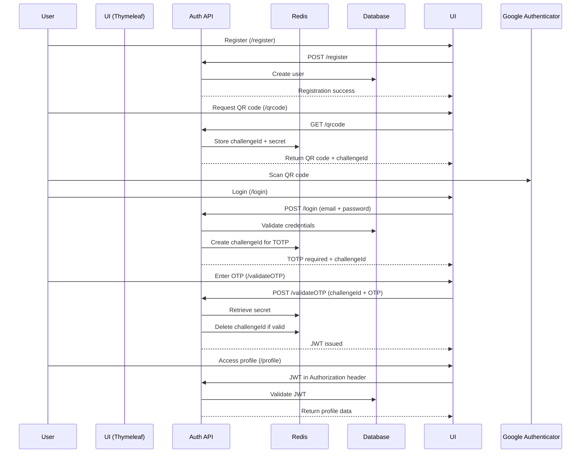

# Secure Authentication Service

**Spring Boot · JWT · TOTP · PostgreSQL · Redis · Docker · Thymeleaf**

## Overview

This application is a secure authentication service built with **Spring Boot**, implementing **JWT-based authentication** with **TOTP (Time-based One-Time Password) multi-factor authentication** using **Google Authenticator**.

It provides:

* Stateless authentication using JWT
* Two-factor authentication via TOTP (RFC 6238)
* Server-side rendered UI using **Thymeleaf**
* Local development environment via **Docker Compose**
* API-first development using **OpenAPI Generator**

---

## Key Features

* **JWT Authentication**

    * Access and refresh token support
    * Stateless security architecture

* **TOTP / 2FA Authentication**

    * QR code generation for enrollment
    * Compatible with Google Authenticator and similar apps
    * One-time codes validated server-side

* **Redis Integration**

    * Stores temporary TOTP challenge IDs and secrets
    * TTL-based automatic expiration

* **PostgreSQL**

    * Supports PostgreSQL **version 15 or earlier**
    * Managed via Docker for local development

* **Thymeleaf UI**

    * Login, enrollment, and verification flows
    * Server-side rendering with Spring MVC

* **Dockerized Development**

    * One-command startup using Docker Compose
    * Environment variables externalized via template

* **OpenAPI-Driven Development**

    * API contract defined in `doc/api.yml`
    * Java client generated via OpenAPI Generator

---

## Technology Stack

| Layer                   | Technology                             |
| ----------------------- | -------------------------------------- |
| Backend                 | Spring Boot                            |
| Security                | Spring Security, JWT                   |
| 2FA                     | TOTP (Google Authenticator compatible) |
| Database                | PostgreSQL (≤ 15)                      |
| Cache/Temporary Storage | Redis                                  |
| UI                      | Thymeleaf                              |
| API Specification       | OpenAPI 3                              |
| Build Tool              | Gradle                                 |
| Containerization        | Docker, Docker Compose                 |

---

## Authentication Flow (High Level)

1. User logs in with email/password
2. If TOTP is enabled:

    * Server creates a temporary `challengeId` stored in Redis
    * User must provide a valid one-time code
3. On success:

    * JWT token is issued
4. JWT is used for subsequent API requests

---

## TOTP Enrollment Flow

1. User requests TOTP enrollment via `/qrcode`
2. Server generates:

    * A shared secret
    * QR code
    * Challenge ID stored in Redis with TTL
3. User scans QR code using Google Authenticator
4. User submits a generated TOTP code via `/validateOTP` for verification
5. TOTP is activated for the account

---

## Sequence Diagram (TOTP Authentication with Redis)



---

## Local Development Setup

### Prerequisites

* Docker & Docker Compose
* Java 17+
* Gradle

---

### Environment Configuration

1. Copy the environment template:

   ```bash
   cp env.template .env
   ```

2. Update values as needed (database credentials, Redis credentials, JWT secrets, etc.).

> **Note:** All sensitive configuration is managed via environment variables.

---

### Running Locally

```bash
docker compose up -d
```

This will start:

* PostgreSQL
* Redis
* The Spring Boot application

---

## Database

* PostgreSQL **15 or lower**
* Schema managed via application startup (or migration tool if configured)
* Data persisted via Docker volume

---

## API Development Workflow

### OpenAPI Contract

* API specification lives in:

  ```
  doc/api.yml
  ```

### ⚠ Important: After Editing `doc/api.yml`

Because this project uses **OpenAPI Generator** to generate the Java client:

```bash
./gradlew clean assemble
```

This ensures:

* Client code is regenerated
* Build artifacts stay in sync with the API contract

---

## Testing Strategy

### Current Coverage

* Unit tests for authentication logic
* Integration tests for API endpoints

### Recommended Improvements

* Add **more integration tests**, especially for:

    * JWT validation
    * TOTP enrollment and verification
    * Redis challenge handling
    * Authentication edge cases (expired tokens, invalid codes)
* Consider Testcontainers for PostgreSQL and Redis integration tests

---

## Project Structure (Simplified)

```
├── doc/
│   └── api.yml
├── src/
│   ├── main/
│   │   ├── java/
│   │   └── resources/
│   │       ├── templates/   # Thymeleaf UI
│   │       └── application.properties
│   └── test/
├── docker-compose.yml
├── env.template
├── build.gradle
└── README.md
```

---

## Security Notes

* JWT secrets must be strong and never committed
* TOTP secrets are stored securely and only temporarily in Redis during validation
* HTTPS is strongly recommended for production
* Consider rate-limiting authentication endpoints